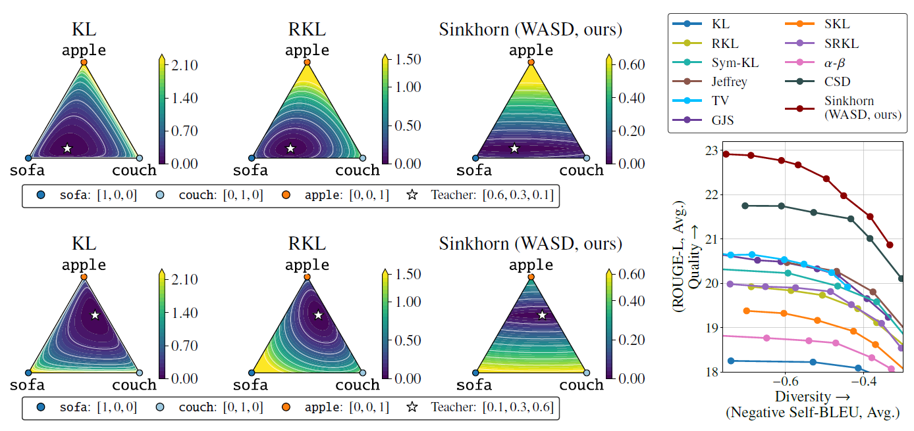

# WASD: Wasserstein-based Knowledge Distillation for Large Language Models (WASD) (NeurIPS 2026)

--------------------

This repository contains the official implementation of **"WASD: Wasserstein-based Knowledge Distillation for Large Language Models"** in **[NeurIPS 2026](https://neurips.cc/Conferences/2026)**.

**[Byeonghu Na](https://sites.google.com/view/byeonghu-na), [Donghyeok Shin](https://sdh0818.github.io/), [Yeongmin Kim](https://sites.google.com/view/yeongmin-space/), [Mina Kang](https://aai.kaist.ac.kr/bbs/board.php?bo_table=sub2_1&wr_id=25), and [Il-Chul Moon](https://aai.kaist.ac.kr)**

**KAIST, summary.ai**

--------------------

**Wasserstein-based Knowledge Distillation (WASD)** is a knowledge distillation objective for large language models that incorporates token-level semantic information through the Sinkhorn divergence with a transport cost derived from token embeddings. The dual potentials of the transport problem are computed by matrix scaling iterations, and the resulting gradient-equivalent objective is optimized without additional networks or backpropagation through the transport solver.



--------------------

## Requirements

We tested the code in the following environment:

- CUDA 12.8
- Python 3.10
- PyTorch 2.7.1
- NVIDIA RTX PRO 6000 GPU

### Installation

```bash
python3.10 -m venv .venv
source .venv/bin/activate
python -m pip install --upgrade pip setuptools wheel

pip install torch==2.7.1 torchvision==0.22.1 torchaudio==2.7.1 --index-url https://download.pytorch.org/whl/cu128
pip install -r requirements.txt
```

The same steps are provided in `install.sh` (`bash install.sh`).

## Datasets

We conduct the GPT-2 instruction-following experiments on [databricks-dolly-15k](https://huggingface.co/datasets/databricks/databricks-dolly-15k) with [OpenWebText](https://huggingface.co/datasets/Skylion007/openwebtext) as the pretraining data, and evaluate on Dolly, Self-Instruct, Vicuna, Super NI, and UnNI, following the same setup as [MiniLLM](https://github.com/microsoft/LMOps/tree/main/minillm) and [AMiD](https://github.com/aailab-kaist/AMiD).

The evaluation data can be downloaded from MiniLLM:

```bash
hf download MiniLLM/dolly --repo-type dataset --local-dir ./data/dolly/
hf download MiniLLM/self-inst --repo-type dataset --local-dir ./data/self-inst/
hf download MiniLLM/Vicuna --repo-type dataset --local-dir ./data/vicuna/
hf download MiniLLM/sinst --repo-type dataset --local-dir ./data/sinst/
hf download MiniLLM/uinst --repo-type dataset --local-dir ./data/uinst/
```

The processed training data can also be downloaded from MiniLLM:

```bash
hf download MiniLLM/dolly-processed --repo-type dataset --local-dir ./processed_data/dolly/
hf download MiniLLM/openwebtext-processed --repo-type dataset --local-dir ./processed_data/openwebtext/gpt2/512/10M/
```

## Models

The pretrained GPT-2 checkpoints are downloaded from the [Hugging Face Hub](https://huggingface.co/models) into `checkpoints/`:

```bash
hf download gpt2 --repo-type model --local-dir ./checkpoints/gpt2-base
hf download gpt2-medium --repo-type model --local-dir ./checkpoints/gpt2-medium
hf download gpt2-xl --repo-type model --local-dir ./checkpoints/gpt2-xlarge
```

## Training Pipeline

Our codebase is built upon [AMiD](https://github.com/aailab-kaist/AMiD), which in turn follows [MiniLLM](https://github.com/microsoft/LMOps/blob/main/minillm/README.md), [DistiLLM](https://github.com/jongwooko/distillm), and [ABKD](https://github.com/ghwang-s/abkd).
For detailed argument descriptions and the baseline methods, please refer to these repositories.

WASD is applied in Step 3 (distillation) as the divergence between the teacher and the assistant distribution of AMiD (`--amid-div-name sink`).

We provide example commands for GPT-2 XL (1.5B) → GPT-2 Base (0.1B). All scripts are run from the repository root with `${BASE_PATH} ${MASTER_PORT} ${GPU_NUM}` as the first three arguments.


### Step 1: Teacher Fine-Tuning (SFT)

```bash
bash ./scripts/gpt2/sft/sft_xlarge.sh ./ 2010 1
```

or download the fine-tuned teacher from MiniLLM:

```bash
hf download MiniLLM/teacher-gpt2-1.5B --repo-type model --local-dir ./results/gpt2/train/sft/gpt2-xlarge
```


### Step 2: Student Initialization

The checkpoint with the best validation loss is used.

```bash
bash ./scripts/gpt2/init/init_base.sh ./ 2011 1
```

or download from MiniLLM:

```bash
hf download MiniLLM/init-gpt2-120M --repo-type model --local-dir ./results/gpt2/train/init/gpt2-base
```


### Step 3: Distillation with WASD

```bash
bash ./scripts/gpt2/wasd/train_0.1B_1.5B.sh ${BASE_PATH} ${MASTER_PORT} ${GPU_NUM} ${amid_alpha} ${amid_lam} ${batch_size} ${lr} ${save_name} "${additional_arguments}"
```

* Main setting (with the pretraining data and on-policy student generation):

  ```bash
  bash ./scripts/gpt2/wasd/train_0.1B_1.5B.sh ./ 2012 1
  ```

* Divergence comparison setting (no pretraining data, no on-policy generation, the student is initialized from the original `gpt2` checkpoint in `checkpoints/gpt2-base`, and the student distribution is used as the assistant):

  ```bash
  bash ./scripts/gpt2/wasd/train_0.1B_1.5B_nolm.sh ./ 2013 1
  ```

* GPT-2 Medium (0.3B) student:

  ```bash
  bash ./scripts/gpt2/wasd/train_0.3B_1.5B.sh ./ 2014 1
  ```

On the first run, the sparse cost matrix is built from the teacher token embeddings and cached under `cost_matrix/`, and subsequent runs reuse it. One checkpoint is saved per epoch under `results/gpt2/train/<run>/<step>/`, and the validation ROUGE-L of every epoch is logged in `results/gpt2/train/<run>/log.txt`.


#### Key Arguments

- `--amid-div-name`: divergence (`sink`: Sinkhorn divergence (WASD), `wass`: entropy-regularized Wasserstein distance without the self-transport correction)
- `--amid-alpha`, `--amid-lam`: assistant distribution hyperparameters of AMiD ($\alpha$, $\lambda$)
- `--wd-cost-type`: distance between token embeddings used as the transport cost (`cos` or `L2`)
- `--wd-cost-emb`: whose token embeddings define the cost (`teacher` or `student`)
- `--wd-cost-dim`: truncation hyperparameter $k$ (nearest-$k$ neighbors kept in the sparse cost matrix)
- `--wd-epsilon`: entropy regularization hyperparameter ($\varepsilon$)
- `--wd-max-iter`: number of Sinkhorn / fixed-point iterations
- `--wd-lambda`: weight of the WASD loss
- `--student-temp`: temperature applied to the student logits during training
- `--wd-sinkhorn-chunk`: number of positions processed per chunk in the scaling iterations (lower it if you run out of GPU memory)

Extra arguments are appended as the last (quoted) argument of the script, e.g. the entropy-regularized Wasserstein ablation:

```bash
bash ./scripts/gpt2/wasd/train_0.1B_1.5B.sh ./ 2012 1 -5 0.5 32 0.0001 abl_wass "--amid-div-name wass"
```

## Evaluation

Our evaluation scripts are directly adapted from [AMiD](https://github.com/aailab-kaist/AMiD) and [MiniLLM](https://github.com/microsoft/LMOps/tree/main/minillm).

Run the evaluation from the repository root with either a checkpoint directory (`results/gpt2/train/<run>/<step>`) or a run directory (`results/gpt2/train/<run>`). For a run directory the checkpoint with the best validation ROUGE-L is selected automatically. Both absolute paths and paths relative to `results/gpt2/train/` are accepted.

```bash
bash ./scripts/gpt2/eval/run_eval.sh ${CKPT_OR_RUN} ${MASTER_PORT}
```

This evaluates the five benchmarks (Dolly, Self-Instruct, Vicuna, Super NI, UnNI) with five seeds, writes the outputs to `results/gpt2/eval_main/`, and prints the mean and standard deviation of ROUGE-L over the seeds.


## Acknowledgements

This codebase builds upon and is inspired by:

- **AMiD**: https://github.com/aailab-kaist/AMiD
- **CSD**: https://github.com/aailab-kaist/CSD
- **MiniLLM**: https://github.com/microsoft/LMOps/tree/main/minillm
- **DistiLLM**: https://github.com/jongwooko/distillm
- **ABKD**: https://github.com/ghwang-s/abkd


## Citation

```bibtex
@inproceedings{
na2026wasd,
title={{WASD}: Wasserstein-based Knowledge Distillation for Large Language Models},
author={Byeonghu Na and Donghyeok Shin and Yeongmin Kim and Mina Kang and Il-Chul Moon},
booktitle={The Fortieth Annual Conference on Neural Information Processing Systems},
year={2026},
}
```
